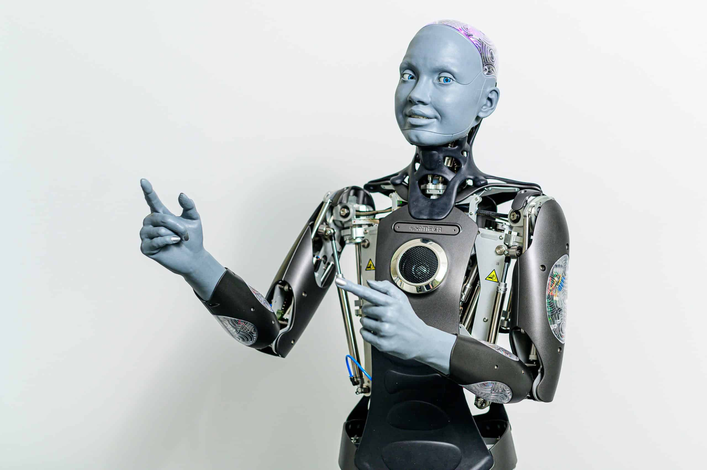

# Awesome Humanoid Robots 🤖

> A curated list of awesome resources about humanoid robots, including companies, platforms, papers, GitHub repositories, and more.

---

## 🤖 Humanoid Robot

  
Companies

- [**Unitree Robotics**](https://www.unitree.com/cn/)   

  
Platforms

- [**Awesome Legged Locomotion Learning**](https://github.com/gaiyi7788/awesome-legged-locomotion-learning)  
  - Description: TODO

---

## 📑 Papers

  
2019

  

- **Learning agile and dynamic motor skills for legged robots**  
  - Authors: [Paper Link](https://www.science.org/doi/10.1126/scirobotics.aau5872)   

  
2020

TODO

## 🐱‍💻 GitHub

  
Repositories

- [**legged_gym**](https://github.com/leggedrobotics/legged_gym/tree/master)   
  - Description: TODO

---

## 🌟 Related Material

  
Research

### Research

- **Learning agile and dynamic motor skills for legged robots**  
  - Paper: [https://www.science.org/doi/10.1126/scirobotics.aau5872](https://www.science.org/doi/10.1126/scirobotics.aau5872)   

  
GitHub Repositories

### GitHub Repositories

- **Awesome Quadrupedal Robots**  
  - Repository: [https://github.com/curieuxjy/Awesome_Quadrupedal_Robots](https://github.com/curieuxjy/Awesome_Quadrupedal_Robots)   

  
Labs & Companies

### Labs & Companies

- **Unitree Robotics**  
  - Website: [https://www.unitree.com/cn/](https://www.unitree.com/cn/)   
  - Description: TODO

---

## 📸 Assets Folder

- **Images**:  
  - `humanoid_2019.png`: Cover image for the 2019 papers section.

---
