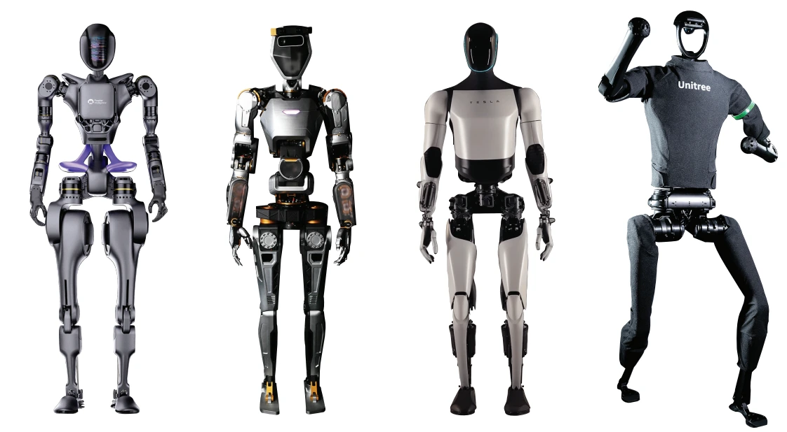

# Awesome Humanoid Robots 🤖

> A curated list of awesome resources about humanoid robots, including companies, platforms, papers, GitHub repositories, and more.

---

## 🤖 Humanoid Robot

  
Companies & Institute

- [**Unitree Robotics**](https://www.unitree.com/cn/)
- [**LimX Dynamics**](https://www.limxdynamics.com/)
- [**Westwood Robotics**](https://www.westwoodrobotics.io/)
- [**APPTRONIK**](https://apptronik.com/)
- [**KEPLER**](https://www.gotokepler.com/home)
- [**ROBOTERA**](https://www.robotera.com/)
- [**AgiBot**](https://www.agibot.com/)
- [**DATAA ROBOTICS**](https://www.dataarobotics.com/zh/)
- [**BostonDynamics**](https://bostondynamics.com/)
- [**Agility Robotics**](https://www.agilityrobotics.com/)
- [**Engineered Arts**](https://engineeredarts.com/)
- [**UBTECH ROBOTICS**](https://www.ubtrobot.com/cn/)
- [**Direct Drive Tech**](https://directdrive.com/)
- [**X-Humanoid (北京人形机器人创新中心)**](https://x-humanoid.com/)
- [**EngineAi**](https://www.engineai.com.cn/)
- [**Leju Robotics**](https://www.lejurobot.cn/zh)
- [**PAL**](https://pal-robotics.com/)

  
Platforms

- [**Awesome Legged Locomotion Learning**](https://github.com/gaiyi7788/awesome-legged-locomotion-learning)
- [**Tien Kung Pro/Lite**](https://x-humanoid.com/opensource.html)
- [**agibot X1**](https://github.com/AgibotTech/agibot_x1_hardware)
- [**TALOS**](https://github.com/pal-robotics/talos_robot)

---

## 📑 Papers

  
2019

  

- **Learning agile and dynamic motor skills for legged robots**  
  - Authors: [Paper Link](https://www.science.org/doi/10.1126/scirobotics.aau5872)   

  
2020

TODO

## 🐱‍💻 GitHub

  
Repositories

- [**legged_gym**](https://github.com/leggedrobotics/legged_gym/tree/master)   
  - Description: TODO

---

## 🌟 Related Material

  
Research

- [**Learning agile and dynamic motor skills for legged robots**](https://www.science.org/doi/10.1126/scirobotics.aau5872)

  
GitHub Repositories

- [**Awesome Quadrupedal Robots**](https://github.com/curieuxjy/Awesome_Quadrupedal_Robots)
- [**Awesome Isaac Gym**](https://github.com/robotlearning123/awesome-isaac-gym)

  
Labs & Companies

- [**Unitree Robotics**](https://www.unitree.com/cn/)   
  - Description: TODO

---

## 📸 Assets Folder

- **Images**:  
  - `humanoid_2019.png`: Cover image for the 2019 papers section.

---
